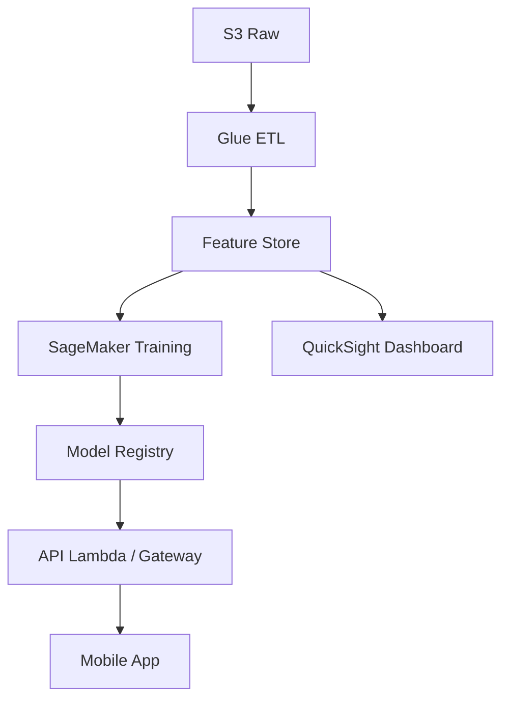

# SmartVault – Hey Banco

¡Bienvenido al repositorio oficial de **SmartVault**, la propuesta ganadora del *Datathon Hey Banco 2025* para la detección y gestión de **gastos recurrentes** con Inteligencia Artificial! 🚀

---

## Tabla de contenido

1. [Descripción general](#descripción-general)
2. [Características clave](#características-clave)
3. [Dataset](#dataset)
4. [Modelado y métricas](#modelado-y-métricas)
5. [Arquitectura de referencia](#arquitectura-de-referencia)
6. [Guía rápida](#guía-rápida)
7. [Estructura del proyecto](#estructura-del-proyecto)
8. [Resultados](#resultados)
9. [Roadmap](#roadmap)
10. [Contribuciones](#contribuciones)
11. [Licencia](#licencia)
12. [Equipo](#equipo)

---

## Descripción general

**SmartVault** clasifica transacciones, identifica patrones periódicos, predice el **próximo cargo recurrente** (fecha, monto y comercio) y habilita acciones de ahorro/auto‑pago dentro de la app de Hey Banco. Además genera scores de anomalía para **detección de fraude**.

> "Dale orden a tu dinero sin complicaciones. Te ayudamos a entender tus gastos, anticipar el futuro y construir el hábito del ahorro con IA." – *datamigos 2.0*

---

## Características clave

* 🔍 **Clasificación multiclase** de transacciones (gasto, ingreso, ahorro/inversión).
* 📅 **Predicción LSTM** de gastos recurrentes con explainability simplificada.
* 🛡️ **Detección de anomalías/fraude** combinando firmas periódicas y MCC de riesgo.
* 💰 **SmartVault**: aparta automáticamente el monto necesario y sigue generando rendimientos.
* 🔔 Recordatorios push, autopago y feedback de usuario “No es recurrente”.

---

## Dataset

| Archivo             | Registros | Periodo         | Descripción                        |
| ------------------- | --------- | --------------- | ---------------------------------- |
| `Transacciones.csv` | 346 k     | Ene‑24 ↔ Ene‑25 | Movimientos bancarios anonimizados |
| `Clientes.csv`      | 1 k       | –               | Datos demográficos básicos         |

> Los datos fueron proporcionados por Hey Banco exclusivamente para el *Datathon 2025* y se encuentran en la carpeta `/data`. **No deben compartirse públicamente.**

---

## Modelado y métricas

| Tarea                    | Algoritmo         | Métrica   | Resultado     |
| ------------------------ | ----------------- | --------- | ------------- |
| Predicción de monto      | LSTM univariado   | MAE       | **10.86 MXN** |
| Predicción de fecha      | Heurístico + LSTM | RMSE días | **53.49**     |
| Detección de recurrentes | Regla + CV        | Acc.      | **90.11 %**   |

*Entrenamiento en GPU Tesla T4 (1 h). Hiperparámetros en **`notebooks/02_train_lstm.ipynb`**.*

---

## Arquitectura de referencia



* Infra AWS < \$300 USD/mes (dev). 100 % serverless en producción.

---

## Guía rápida

### Requisitos

```bash
conda env create -f environment.yml
conda activate smartvault
```

### Pre‑procesamiento & firma de periodicidad

```bash
python scripts/preprocess.py --input data/Transacciones.csv --out data/clean.parquet
python scripts/build_signatures.py --in data/clean.parquet --out data/signatures.parquet
```

### Entrenamiento

```bash
jupyter notebook notebooks/02_train_lstm.ipynb
```

### Scoring en lote

```bash
python scripts/batch_predict.py --model models/lstm.onnx --transactions data/clean.parquet --out predictions.csv
```

### API local

```bash
uvicorn api.main:app --reload --port 8000
```

`POST /predict` con JSON de transacción y recibe `{next_date, amount, confidence}`.

---

## Estructura del proyecto

```
.
├── api/                # FastAPI para scoring en tiempo real
├── data/               # CSV/Parquet (IGNORADO en .gitignore)
├── docs/               # Presentación, mockups Figma, PDF reto
├── models/             # Pesos entrenados (.onnx, .pkl)
├── notebooks/          # Jupyter para EDA y entrenamiento
├── scripts/            # Utilidades CLI (preprocesamiento, firmas, batch)
├── tests/              # Pytest con fixtures sintéticos
├── environment.yml     # Conda env reproducible
└── README.md           # ¡estás aquí!
```

---

## Resultados

* **Ahorro potencial** al apartar gastos: ↑ 40 % tasa de ahorro mensual.
* **Reducción de churn** estimada: ‑2 pp en cohorte tratada.
* **ROI** (12 m): \~400 % → *Costo* ≈ 8 k USD. *Beneficio* ≈ 40 k USD.

Detalle en `docs/Slides_Datathon.pdf`.

---

## Roadmap

*

Contribuye via *Pull Request* y comenta en *Issues*.

---

## Contribuciones

1. Haz *fork* del repo.
2. Crea una rama (`git checkout ‑b feature/nueva‑feature`).
3. *Commit* y *push* (`git push origin feature/nueva‑feature`).
4. Abre un *Pull Request* explicando tu aporte.

> Código bajo **cobertura ≥ 90 %** + pasar `pre‑commit` hooks.

---

## Licencia

MIT © 2025 Datamigos 2.0

---

## Equipo

| Nombre           | Rol            | Organización   |
| ---------------- | -------------- | -------------- |
| César Sánchez    | Data Scientist | Linde‑Interius |
| Braulio Martínez | Data Engineer  | –              |
| Emilio Ramírez   | ML Engineer    | Heineken       |
| Santiago Juárez  | Product & UX   | Linde          |

Diseño y mantenimiento por **datamigos 2.0** – *¡Gracias por pasarte!*
